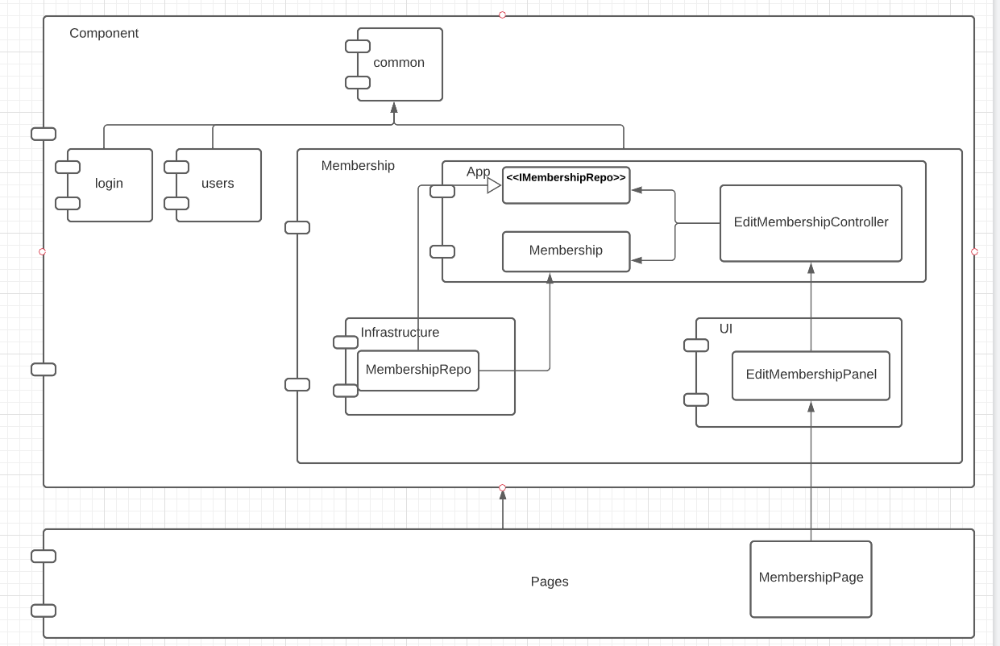

#Arquitectura

Descripción del diseño

Responsabilidades de los componentes grandes:

	Pages  
		-aqui va el codigo integrado de cada pagina del sitio web. Este lo puse mas que nada porque use un template de un framework para react que se llama next y ya lo incluye

	Component 
		-aqui va cada uno de los componentes que se incluira en las paginas. En mi caso, es login, users y memberships

		Common
		-Esto lo puse mas que nada porque en el caso de los repositorios se repetia mucho codigo. Entonces agregue este componente para reutilizarlo

Reponsabilidades de cada componente en Membership:	
	
	Infrastructure
		- Contiene los repositorios con el código de acceso a datos. En este caso es una lista de membresias que se guarda en el local storage

	UI
		-Contiene los componentes de react, es decir las vistas
		-Tambien es el componente en donde se inicializan los objetos (el componente que pega todos los demas componentes)

	App
		-Contiene las entidades, en este caso la clase Membership. Aqui deberia ir la logica que esta mas casada a los negocios. (Por ejemplo algun calculo de un descuento para alguna membresia)
		-Contiene las interfaces de los repositorios. Se pusieron en este componente para invertir la dependencia con infrastructure
		-Contiene los controllers, en este caso los EditMembershipController. La responsabilidad de este controller es aceptar las entradas del usuario (eventos del raton, teclado, mouse, clicks, etc), procesarlas, y despues mandar a refrescar la vista atraves de callbacks
